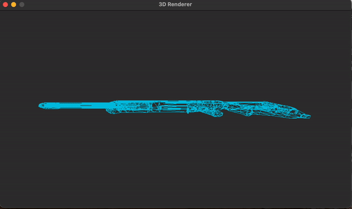

## py3D

Simple 3D engine that loads and renders objects from obj files.


## Setup and run

Install the required packages:

```bash
pip install -r requirements.txt
```

Then run:

```bash
python main.py
```

## Todo:

- Camera movement
- Culling
- Clipping
- Texture
- Depth buffering
